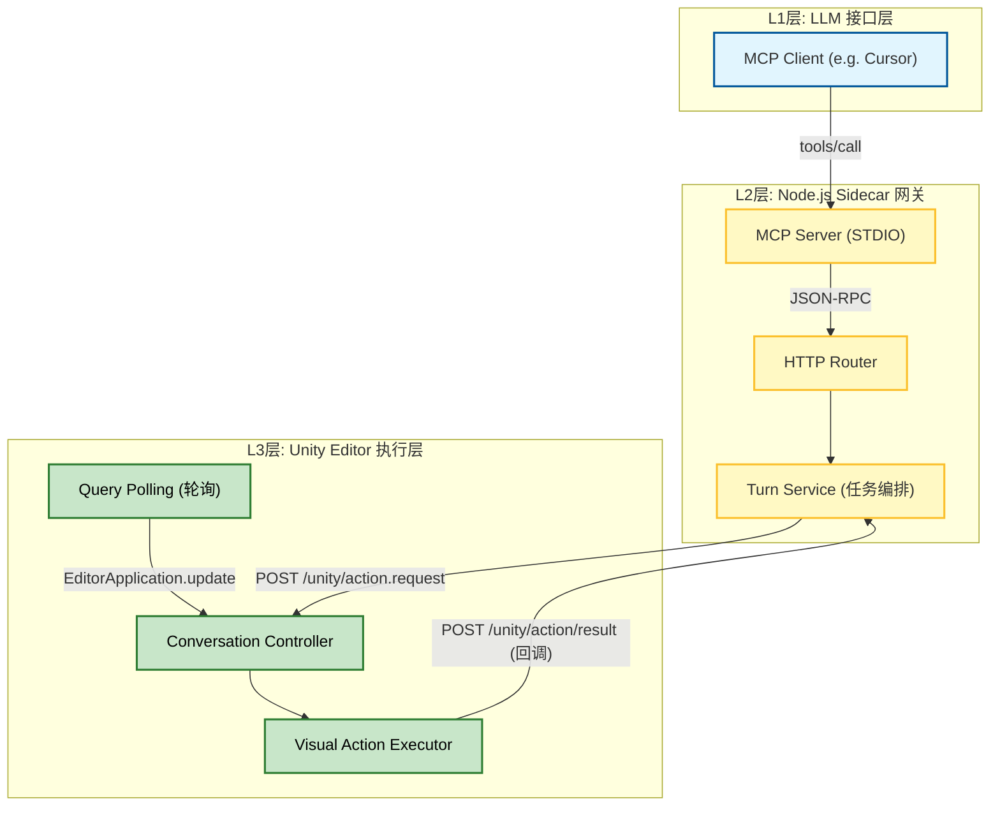

# 独立开发的新武器：从聊天框复制粘贴，到三层架构接管 Unity Editor

> 一年多前离开公司时，最大的驱动力是对 AI 崛起的焦虑。看着各种 Copilot 进化，我一直在想：如果 AI 终将写出比我更好的代码，那开发者的核心壁垒究竟还剩什么？
> 折腾了一圈 Web3 和各种工具链后，我找到了现阶段的答案：**不再去做那个“写代码的人”，而是去构建“让 AI 能顺畅施展拳脚的基础设施”。**

这篇文章复盘我最近死磕的一个硬核项目：**Unity AI (LLM + MCP)**。
简单来说，我不仅想让大模型帮我写脚本，我还想让它能直接“看”懂我的 Unity 层级树，并像一个真策划/TA 一样，直接在场景里创建 UI、挂载组件、调整 Transform，甚至帮你保存预制体。

## 01. 痛点：为什么“复制粘贴”救不了生产力？

现在大家用 AI 辅助开发 Unity，最典型的流程是这样的：
1. 截图或复制一堆代码给 Claude/GPT。
2. 告诉它：“帮我写个脚本，生成一个 Button，挂上某个组件”。
3. AI 吐出代码。
4. 你把代码复制回 Unity，编译，运行。

这本质上还是**“你”在驱动工具**。
随着项目变复杂，你每天会有大量时间浪费在“向 AI 描述当前上下文”和“手动执行 AI 的建议”上。

所以，我盯上了 **MCP (Model Context Protocol)** 协议。通过 MCP，我们可以把 Unity Editor 的能力封装成一组 API（Tools），直接暴露给 LLM（比如 Cursor），让大模型从“军师”变成“执行者”。

## 02. 架构抉择：为什么是三层混合架构？

直接在 Unity 里写一个 TCP Socket 来接 LLM 的指令行不行？
行，但极度难受。Unity 的 C# 环境（尤其是在 Editor 模式下）处理复杂的网络协议、鉴权、并发管控，简直就是灾难。

为了保证系统的健壮性和可扩展性，我把整个系统拆成了**三层混合架构（L1/L2/L3）**：

### L1 层：MCP Client
基于 `JSON-RPC 2.0` 协议，通过 `STDIO` 与下游通信。这一层什么业务逻辑都不干，只负责接收 LLM 指令和暴露能力字典。

### L2 层：Node.js Sidecar
这是整个系统的**“大脑和交警”**。
我用 Express 跑在 `127.0.0.1:46321`，它负责拦截所有 MCP 指令，做 Schema 校验、OCC（乐观并发控制）门禁、双锚点校验。只有通过校验的安全指令，才会被组装成 HTTP 请求发给 Unity。

### L3 层：Unity Editor
纯粹的**“执行肌肉”**。
核心难点是：**Unity Editor 的 API 必须在主线程调用。**
如果在网络请求的回调里直接去 `GameObject.CreatePrimitive()`，Unity 会直接给你报一个鲜红的 Thread 错误。所以我在 `ConversationController` 里加了基于 `EditorApplication.update` 的轮询机制，把异步的 HTTP 任务通过 `SynchronizationContext` 安全地调度回主线程。

## 03. 核心深水区：读写隔离与并发控制

这个系统最容易出 Bug 的地方，是 LLM 的“幻觉”和“状态不同步”。

假设 LLM 想修改一个叫 `Button_Confirm` 的按钮：
1. 它先查询（Read），发现按钮在 `Canvas/Panel/Button_Confirm`。
2. 你手欠，在 Unity 里把这个按钮拖到了别的地方，或者改了名。
3. LLM 根据刚才的记忆，下达修改指令（Write）。
4. 系统崩溃，或者改错了对象。

为了解决这个问题，我引入了类似数据库事务的 **OCC（乐观并发控制）** 和 **SSOT（单一真相源）** 机制。

所有写操作，都必须携带一个 `based_on_read_token`。如果在 LLM 思考期间，Unity 的 `scene_revision`（场景版本号）发生了变动，L2 层的校验器会直接拦截，抛出 `E_STALE_SNAPSHOT` 错误，强制要求 LLM 重新获取最新的场景快照。

这就好比给 AI 立了个规矩：**“行动前，必须先确认手里的地图是不是最新的”**。

## 04. 那些让我头疼的“痛点”与坑

当然，任何系统都不可能完美。全链路跑通后，新的痛点开始暴露：

### 1. Token 失效导致的“过度交互”
因为我要求每一次写操作后 Token 都会失效（为了保证状态绝对一致），导致多步操作时，LLM 必须“改一下 -> 重新查 -> 再改一下”。对于人类来说，我们是“规划-执行”分离；但对现在的 MCP 系统，变成了“规划-执行-等待-规划-执行”的无限循环，网络往返的延迟（Latency）感知非常明显。

### 2. 新增工具的开发体验（DX）极差
为了让 LLM 明白每个工具的参数，我做了一套庞大的 SSOT 字典（`tools.json`）。现在我要新增一个 MCP 工具，需要经过 7 个步骤：

> 改 JSON -> 重新 build 生成 L2/L3 产物 -> 手写 L2 层的桥接文件 -> 手写 Validator -> 手写 Handler -> 注册路由 -> 重启服务。

虽然逻辑复用度高达 90%，但这种机械劳动简直是反人类的。下一步我准备写个脚手架，把这些模板代码全部自动化生成。

### 3. 异常处理的回退泛化
早期为了省事，很多深层错误都会被兜底成一个宽泛的 `E_INTERNAL` 返回给大模型。结果就是 AI 经常“一脸懵逼”，不知道该怎么修复。后来我专门在 L2 层重写了 `mcpErrorFeedback.js`，把 Unity 抛出的异常归一化，强制要求每个错误码都必须附带 `suggestion`（可操作建议）和 `retry_policy`，手把手教 AI 怎么从错误中恢复。

## 05. 性能对比与能力暴露

目前，系统已经稳定注册了涵盖增删改查、层级管理、UI 布局、乃至事务控制（Transaction）在内的数十个 Tool。

随便举个例子，LLM 现在可以通过单一指令 `execute_unity_transaction`，在一个原子事务里完成：

> 创建 UI Panel -> 设置锚点 -> 实例化两个 Button -> 调整它们的 Layout Element 约束 -> 修改文字颜色。

中间任何一步失败，直接执行完整回滚。

这在以前纯靠手拼 UI 的项目里（对，说的就是我在前公司维护的那个老牌卡牌游戏），这种自动化效率简直是降维打击。

## 06. 写在最后

这套 Unity AI 架构，从最初单纯的“让大模型帮忙写 C#”，进化到了如今具备“看、思考、动手”完整闭环的工程系统。

它并不是完美的，但我在这其中真切地感受到了开发范式的转变。
以前做独立开发，我们是把精力耗在切图、拼预制体、写胶水代码上；现在，**我们的核心价值，变成了设计一套好的规则、协议和上下文门禁，然后把具体的执行交给数字生命去完成。**

从对 AI 的焦虑，到主动构建驯服 AI 的缰绳。
我想，这或许就是作为一名程序员，在这个大变革时代里最好的自处方式吧。

---

> 项目依然在填坑与重构中，欢迎探讨交流。